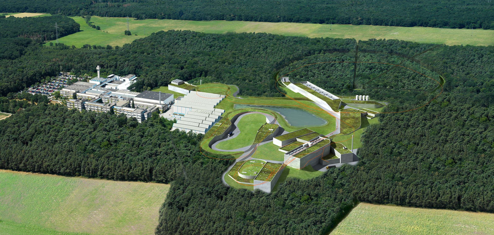
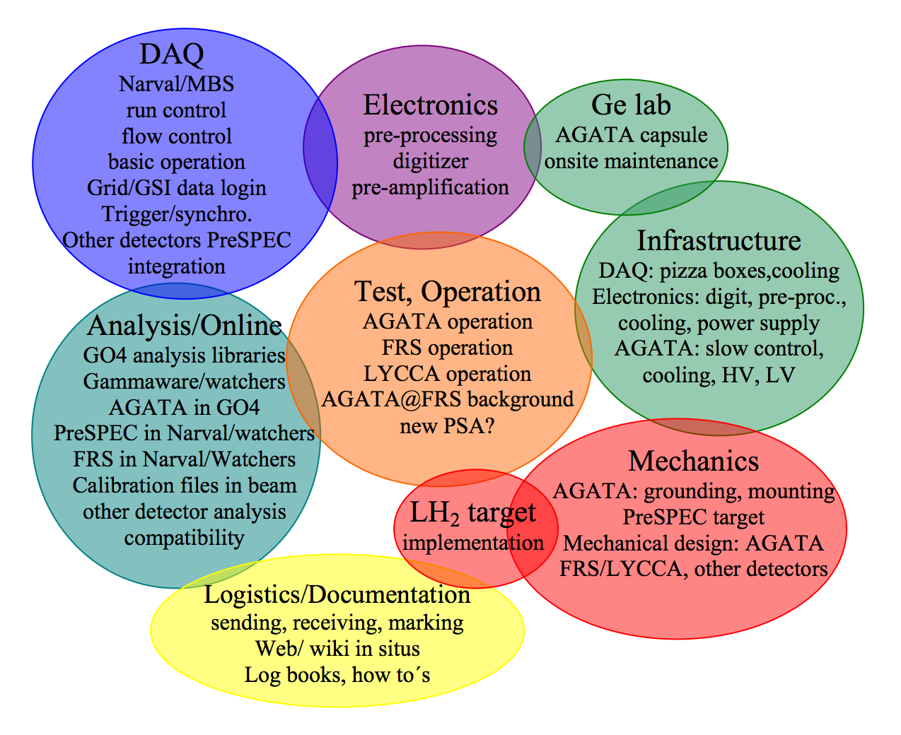
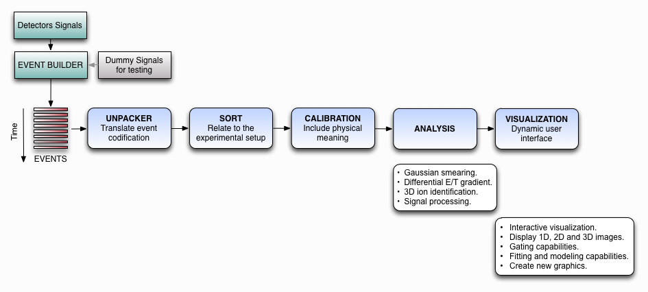
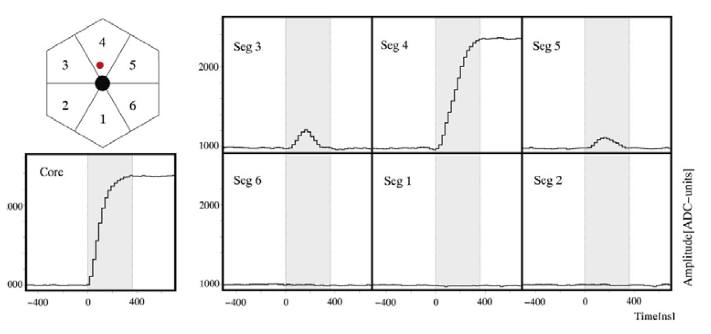
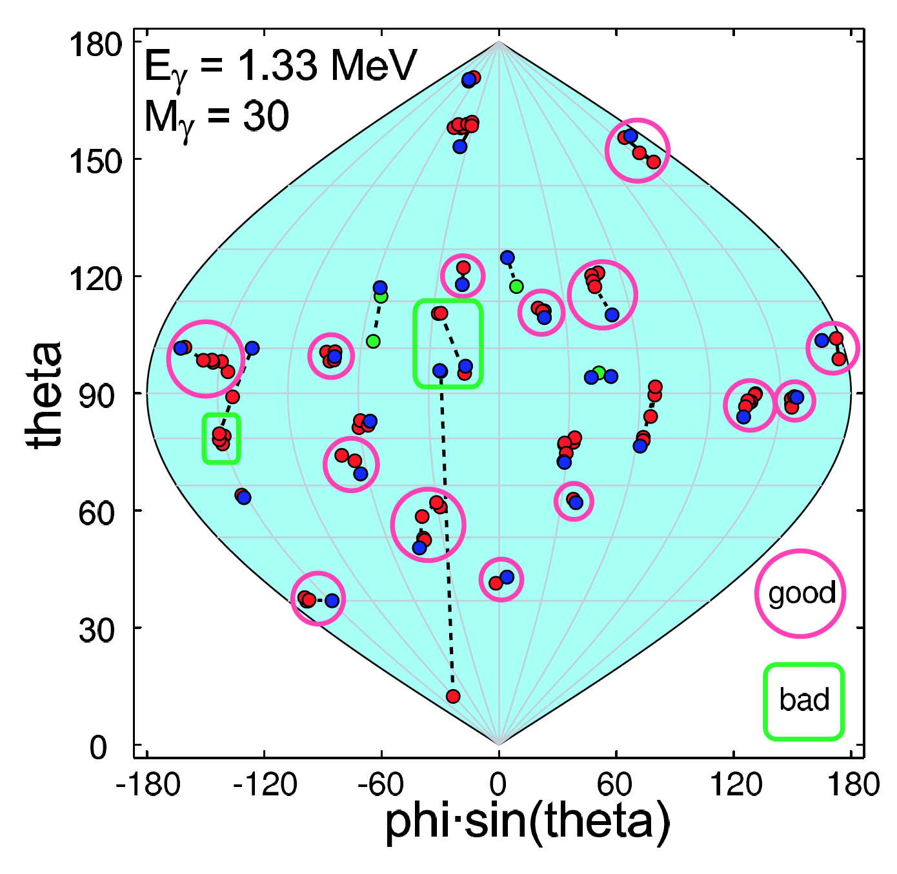
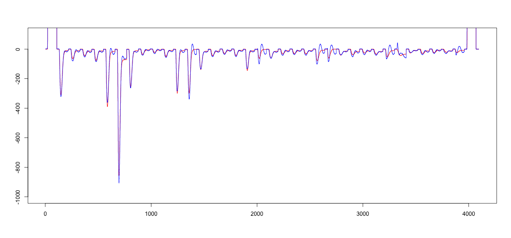
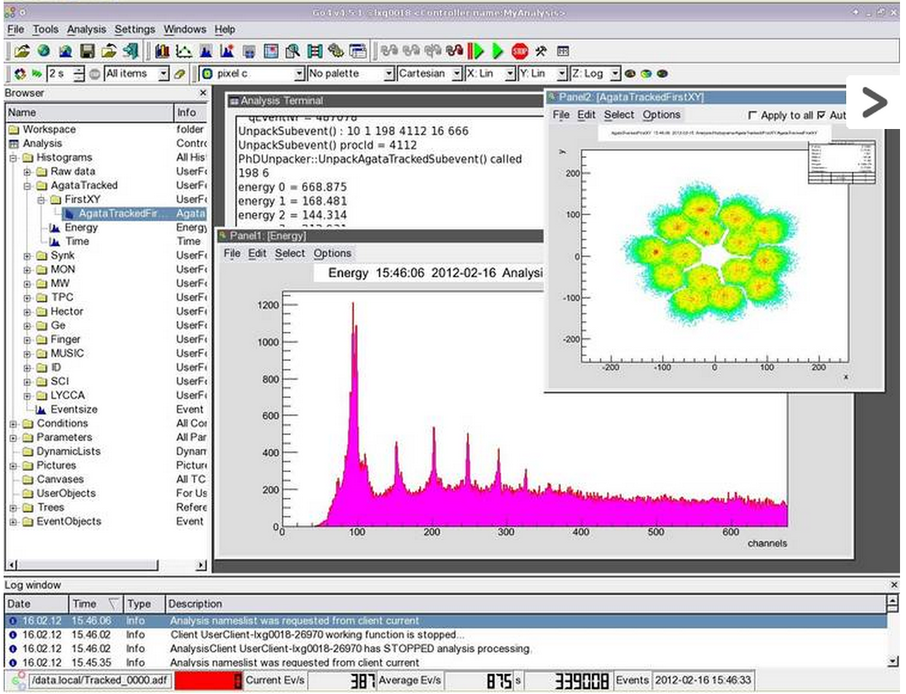

<!-- Limit image width and height -->

## Outlock

1. What they do at GSI?
2. Prespec project. 
3. Teams and technology.
4. Software requirements.
5. Data source. 
6. Software structure.
7. General analysis.
8. Analysis example: Gamma 3D detection.
 
---
* What if?...

--- .class #id 

## GSI (Heavy Ion Research Institute)

--- &twocol

## Prespec project

*** =left
- About 34 research groups from 12 different countries.
- Around 250 scientist.

### Tasks:
- Perform highly complex nuclear physics experiments
- Develop top of the line detector systems. 
- Dig through TBytes of data to find unique signatures. 
- Push the boundaries of nuclear physics knowledge. 

*** =right

    

--- &twocol2 

## Teams and technology.

*** =left

*** =right

Local team:

- 10 Postdocs and Engineers.
- 12 Ph.D. students.

Analysis & Online:

- 1 Full-time postdoc (Me).
- 2 Part-time postdocs.
- 3 Ph.D. Students.

Technology:
- Bash.
- Object-oriented c++.
- Root framework (Cern).
- Go4 framework.

---

## Requirements

1. Work with a version control system (mercurial).
2. Software documentation system (doxygen).
3. Wiki page for team and users interaction.
5. Run on linux or mac pc or laptop.
6. Create installation package as an Arch/Ubuntu package for the users, defining all the environment variables, folders and supporting libraries needed.
7. The software had to be easy to use, and flexible to be modified by PhD students. 

---

## Data source

1. The Data Analysis team had the responsibility to analyze online (real-time) the data obtained from experiments performed at the $latex \gamma$-spectroscopy Group at GSI. 
2. The data was coming from many different type of detectors connected via analog-digital signal (ADC) and time-digital (TDC) converters. The full experiment contained:
 * 12 VME crates, 24 modules, 64 bus signals. Total of > 18000 individual signals.
 * Total data collected about of 1TB/day of experiment.
3. The signals were preprocessed throughout the GSI data acquisition system which builds the data into and event. An event is a binary data frame that contains all the necessary information.
 * Geographical position of the signal -> which detector
 * size of the data -> how many bites  
 * timestamp -> To temporally correlate the data

---

## Software Structure

---

## Analysis
* Basic spectra: Gaussian smearing from the calibration, linear and non-linear regression.
* Differential energy/temporal gradient for particle tracking detectors.
* 3D reconstruction for ion identification.
* Gamma spectroscopy: Signal processing.    

    

---

## Gamma 3D detection
Deconvolution (reverse analysis).

---

## Gamma interaction

* Gamma rays interact with matter via Compton scattering.

$$latex
E_{\gamma}=\frac{E_{\gamma_0}}{1-\cos{\theta}}
$$

    

---&twocol3

## Gamma 3D mapping

***=left

***=right

* The interaction points form clusters. 
* Cluster identification and selection is performed following the Compton scattering formula.

---

## Signal Processing

Noise reduction (Filtering), parametrization reduction (random forest).
* Takes more than 200 parameters!

 

---&twocol

## Gamma Spectroscopy

***=fullwidth
Histograming, Gaussian fitting.

***=left
 

***=right
 

---

## Visualization
* Interactive visualization is provided to the users. 
* They have to be able to manipulate ranges, superposition and gate selection. 
* Display 1D, 2D and 3D visualization and projections.
* Gating capabilities (querying!), select data by other related variables in a visual form.
* Fitting and modeling capabilities.
* Create new graphics from new variables.

### Performance challenges.
* Memory efficient, specialy for 2D and 3D visualization.
* Fast, process at least 4000 events/s.

---

## User interface

---

## What if?

With some more computer infrastructure:
* Use c++ libraries  like TBB and PPL to include parallel programming.
* Use a scheduling optimization to run different analysis.
* Utilize servers to store the data more efficiently to facilitate access.

---

## Thank you.

---

